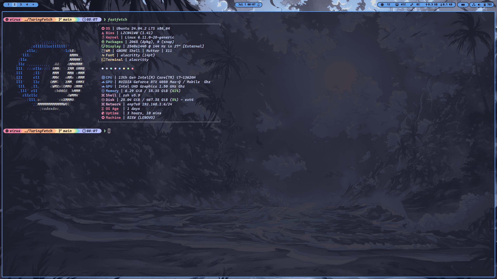

# TuringFetch

My custom fastfetch config file for TuringTeam.

Here’s a screenshot of the app:

# Requirements

Fastfetch should be installed.
Check this page if it's not already installed.
https://github.com/fastfetch-cli/fastfetch.

#Installation

1) Clone the project.
https://github.com/Arashmoez/TuringFetch.git

2) Change your directory to the TuringFetch folder.

3) If you already have config file proceed, if not run `fastfetch --gen-config` in your shell.

4) Copy the config-turing.jsonc ( if on MacOS or Linux ) or config-turing-win.jsonc ( if on Windows )  and Turing.txt to the fastfetch configuration directory.
for MacOS and Linux machines the fastfetch configuration file typically residses in ~/.config/fastfetch , and for Windows in C:\Users\<YourUsername>\AppData\Roaming\fastfetch\config.jsonc. 

5) Remove the config.jsonc file and rename the config-turing.jsonc ( config-turing-win.jsonc for Windows users ) file to config.jsonc ( IMPORTANT-NOTE : If you want to not lose your current fastfetch config file copy your current config.jsonc into a backup file. ) 

*************************************************
Automated Script is available for Linux and MacOS:

Make it executable if already not:
`chmod +x ./install.sh`

Run:
`./install.sh`

Windows script will be under development.

If you encounter any issues please contact me, it's highly appreciated.
 
